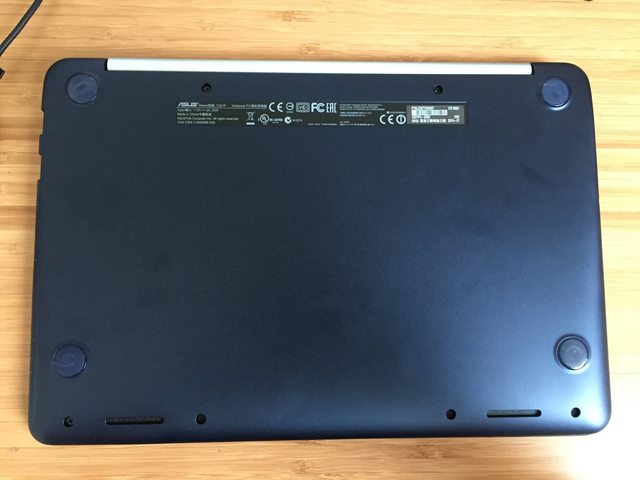
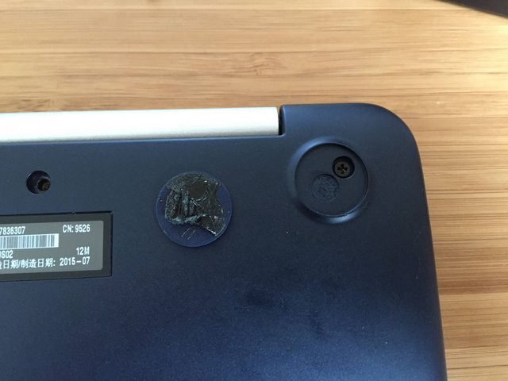
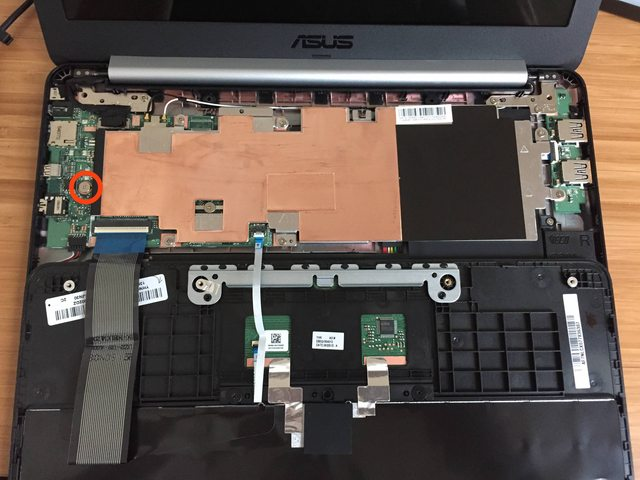
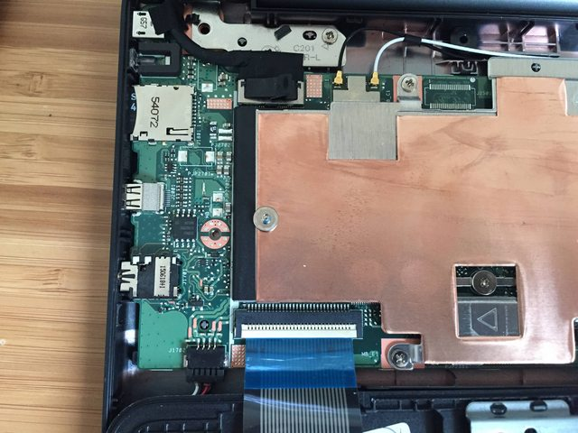
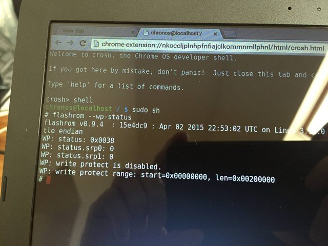

## Write Protection
If you want to remove ChromeOS and get another os, e.g. GalliumOS, or just change boot orders, remove chrome bitmaps or install the UEFI boot loader, then you must have the write protection screw or jumper taken out. For different models there are different instructions, so search up "(Type your model - It can be found at the bottom of the chromebook) write protect screw" in google and you might be able to find what you're looking for.

For this tutorial though, we are using the Asus c201 chromebook.

Put the Chromebook in [developer mode](developer-mode.md), then power off your chromebook and flip the powered-off machine over and remove 8 philips-head screws. 2 are located under rubber feet.

With a plastic spudger/guitar pick, separate the blue case from the silver keyboard/trackpad tray. Slide the spudger along the outer seam to separate it (you'll hear a bunch of clicks).

Don't pull the bottom piece off or you'll pull out the cables to the keyboard.
Once the bottom piece is completely separated, flip the laptop over and open the lid. The keyboard should be loose. Pick it up just enough to flip it over without separating the cables.
Locate the write-protect screw on the left side (highlighted in red here).

Remove the screw.

Flip the keyboard back over so you can type, and power the machine on. Hit Control+D at the boot screen.

Click "Sign-in as guest", hit `Control+Alt+T` to open crosh, then `shell`, `sudo sh`, and `flashrom --wp-disable`. It should report success. flashrom --wp-status should confirm that write protection is disabled.

`halt -p` to power down, snap keyboard tray back in, put screws and rubber feet back.
